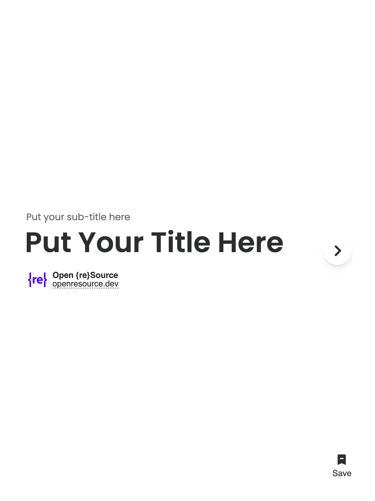
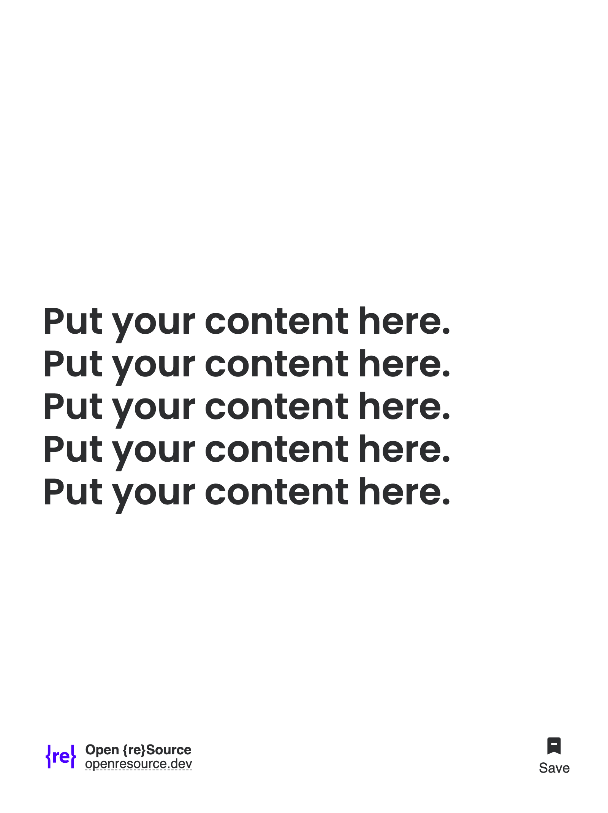
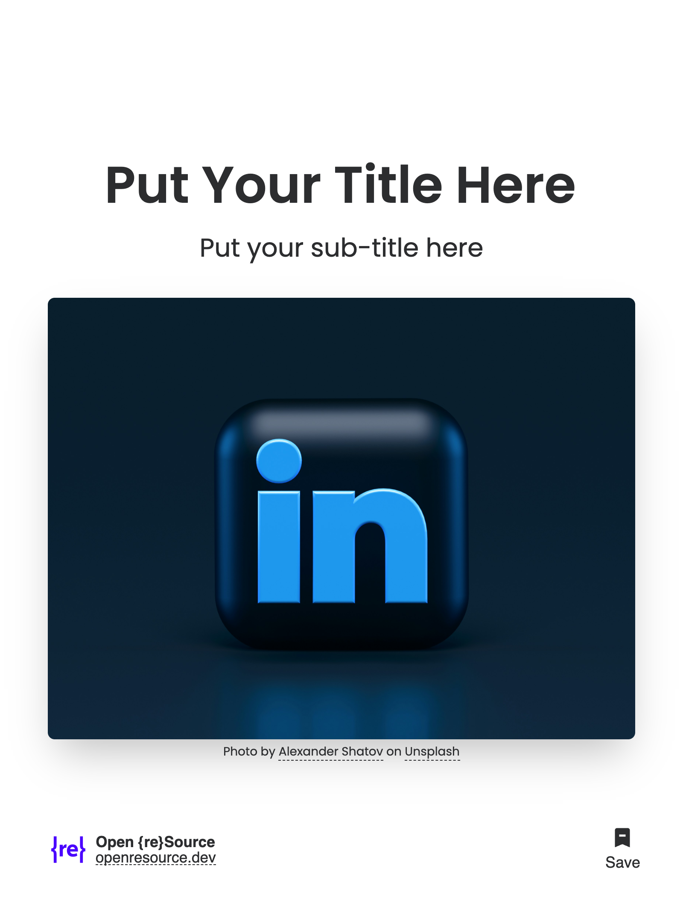
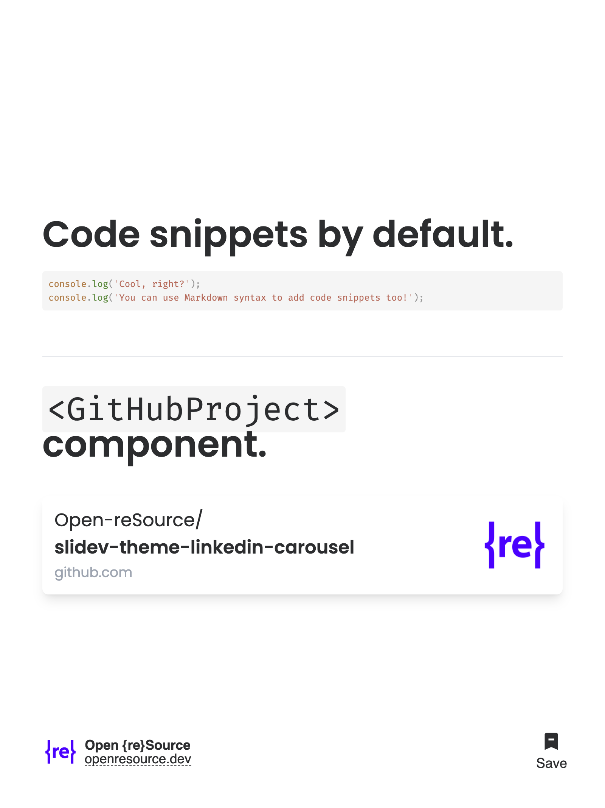
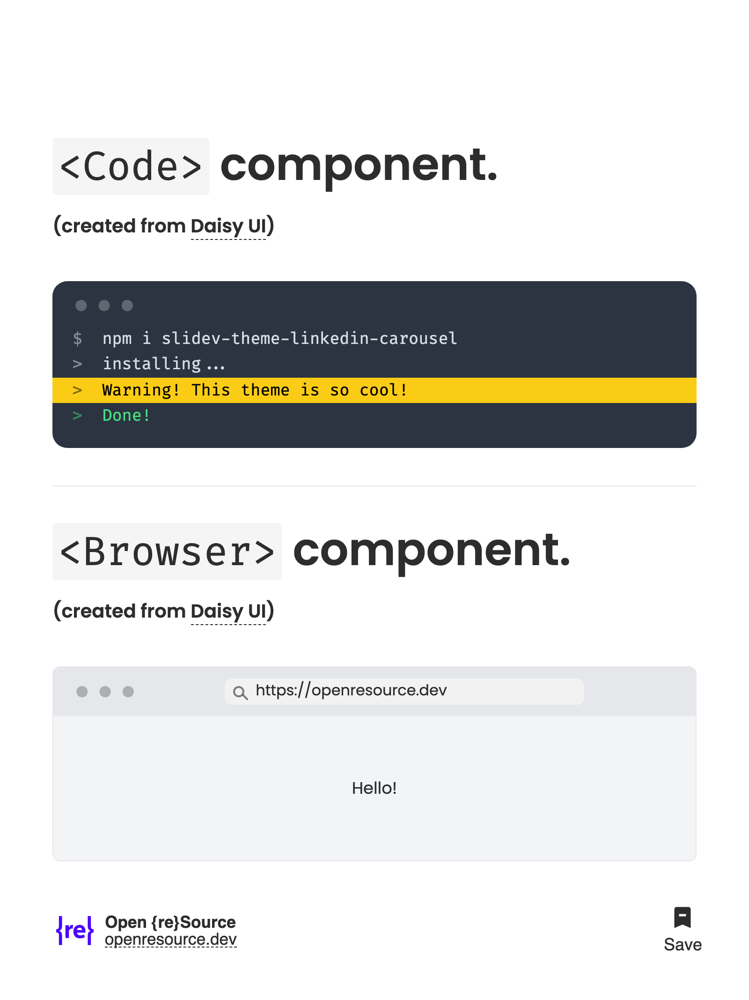
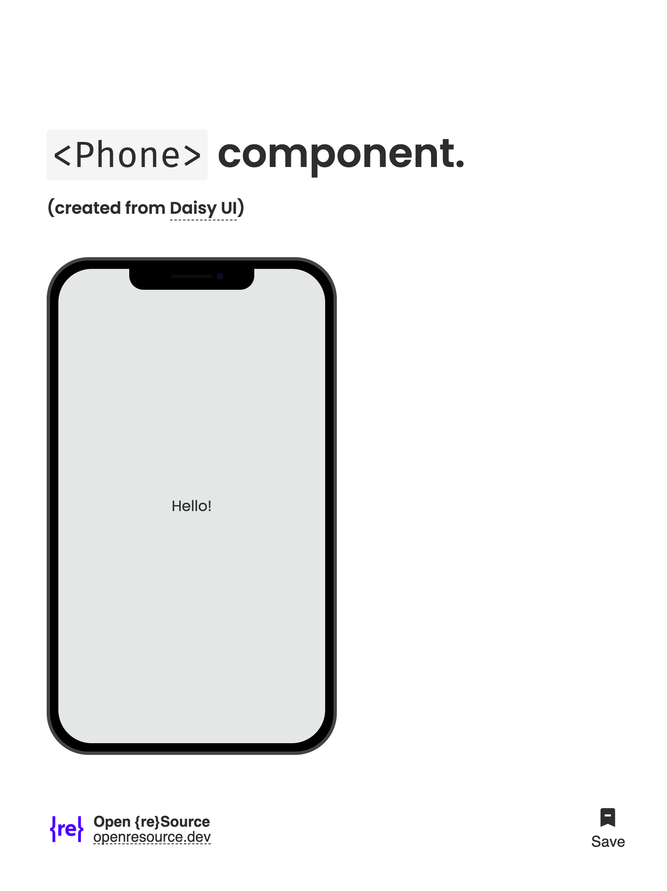

# Slidev Theme LinkedIn Carousel

A [Slidev](https://github.com/slidevjs/slidev) theme to create LinkedIn carousels.

## Install

Add the following frontmatter to your `slides.md`. Start Slidev then it will prompt you to install the theme automatically.

<pre><code>---
theme: <b>linkedin-carousel</b>
---</code></pre>

Learn more about [how to use a theme](https://sli.dev/guide/theme-addon#use-theme).

## Layouts

This theme provides the following layouts:

* `cover` - A cover slide
* `default` - A default slide
* `image-emphasis` - A slide with a big image, a title, and a subtitle

## Components

This theme provides the following components:

* `Browser` - A browser window
* `Code` - A code block with a terminal window
* `GitHubProject` - A GitHub project card
* `Phone` - A phone window

## Contributing

- `npm install`
- `npm run dev` to start theme preview of `example.md`
- Edit the `example.md` and style to see the changes
- `npm run export` to generate the preview PDF
- `npm run screenshot` to generate the preview PNG

## Create a LinkedIn Carousel

* Once you have your LinkedIn carousel ready, you can export it to a PDF using `npm run export`.

* Rename the `example-export.pdf` to have a real name; LinkedIn documents are indexed by search engines by their file name.

* Compress the PDF using [SmallPDF](https://smallpdf.com/compress-pdf) or any other tool.

* Go to your LinkedIn profile, create a new post, and add the PDF as a document.

## Screenshots

